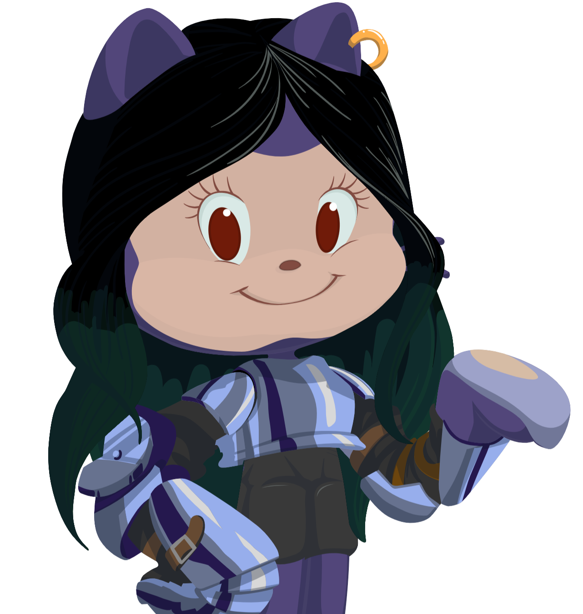

<h1 align="center">
  <a href="https://git.io/typing-svg" style="text-decoration: none;">
    
      
    
  </a>
</h1>

<h1 align="center">A Passionate Software Developer from India 🇮🇳</h1>

  

- 🔭 I’m currently working on **Deep Learning and Full Stack**

- 🌱 Currently on my **Nth** tutorial

- 👯 I’m looking to collaborate on **Deep Learning Projects**

- 💬 Ask me about **Anything**

- ⚡ Fun fact - **I'm IRON 1**

# 🛠️ Tech Stack:

  

# ✨ My GitHub Stats:

 

 

# 🏆 GitHub Trophies:

